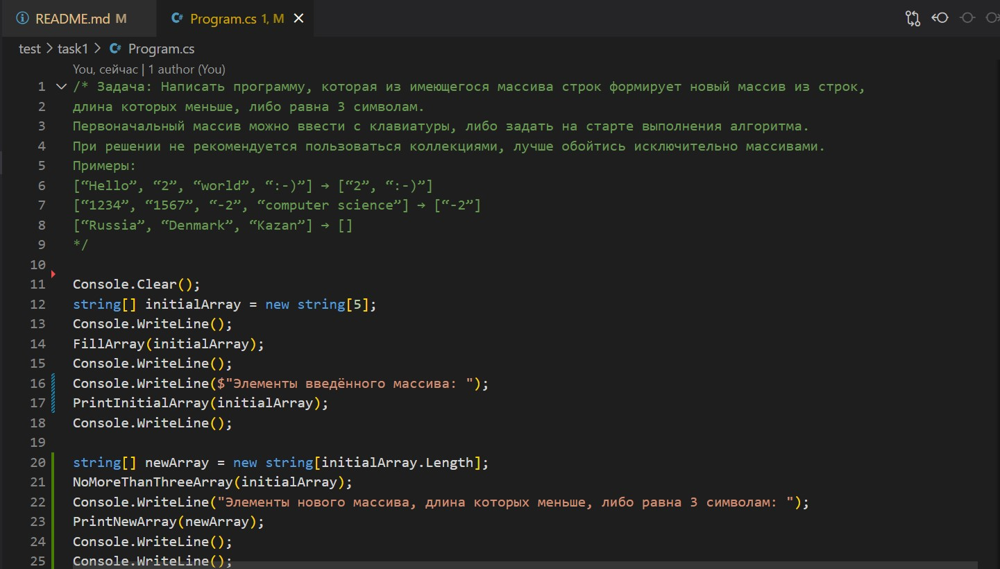
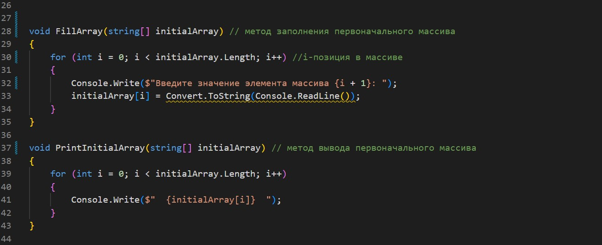
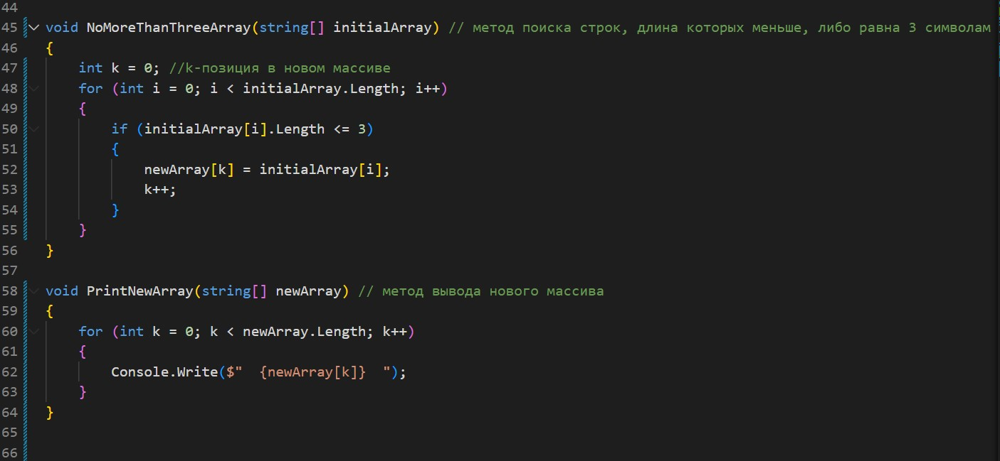
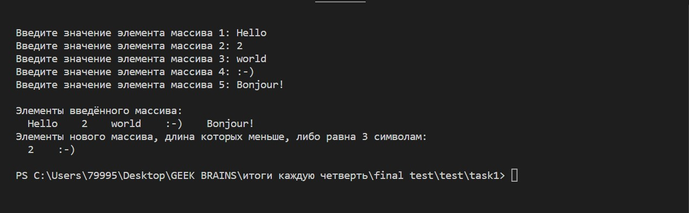

# *Итоговая проверочная работа* #
Для полноценного выполнения проверочной работы необходимо:

    1. создать репозиторий на GitHub;
    2. нарисовать блок-схему алгоритма (можно обойтись блок-схемой основной содержательной части, если вы выделите её в отдельный метод);
    3. снабдить репозиторий оформленным текстовым описанием решения (файл README.md);
    4. написать программу, решающую поставленную задачу;
    5. использовать контроль версий в работе, над этим небольшим проектом (не должно быть так, что все залито одним коммитом, как минимум этапы 2, 3 и 4 должны быть расположены в разных коммитах).

### **Задача:** ###
Написать программу, которая из имеющегося массива строк формирует новый массив из строк, 
длина которых меньше, либо равна 3 символам. Первоначальный массив можно ввести с клавиатуры, 
либо задать на старте выполнения алгоритма. При решении не рекомендуется пользоваться коллекциями, 
лучше обойтись исключительно массивами.
### **Примеры:** ###

>[“Hello”, “2”, “world”, “:-)”] → [“2”, “:-)”]

>[“1234”, “1567”, “-2”, “computer science”] → [“-2”

>[“Russia”, “Denmark”, “Kazan”] → []

### **Решение:** ###
*1. Блок-схема алгоритма:*

*2. Описание алгоритма:*

1. Создаём массив initialArray из 5 элементов (так как в задании не указано, сколько нужно, выбрала своё количество).
2. В методе FillArray в цикле for проходимся по каждому индексу-позиции массива, которые заполняются пользователем вручную (пользователь получает предложение заполнить и заполняет массив).
3. Выводим строку "Элементы введённого массива: " и вызываем метод PrintInitialArray, который выведет заполненный массив на экран с новой строки.
4. Создаём новый массив newArray для заполнения элементами из массива initialArray, длина которых меньше, либо равна 3 символам.
5. Вызываем метод NoMoreThanThreeArray. В данном методе проверяется каждый элемент  массива initialArray на соответствие длины по условию задачи. Если длина элементов массива initialArray меньше, либо равна 3 символам, то эти элементы заполняют новый массив newArray. 
6. Выводим строку "Элементы нового массива, длина которых меньше, либо равна 3 символам: " и вызываем метод PrintNewArray, который выведет новый массив newArray на экран с новой строки.

*3. Программа:*

*4. Терминал:*

